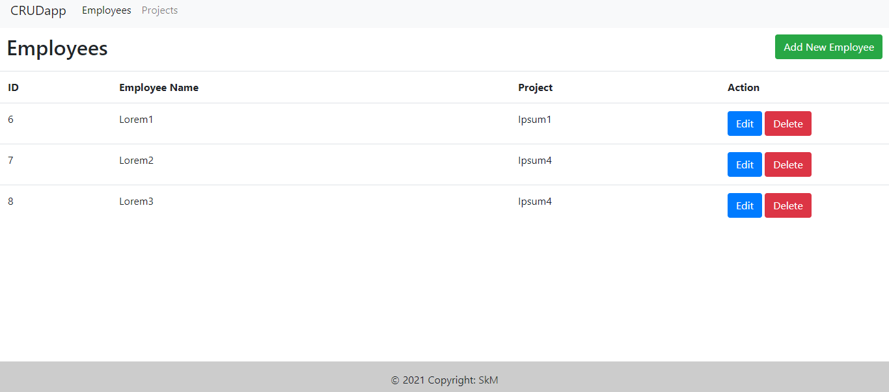
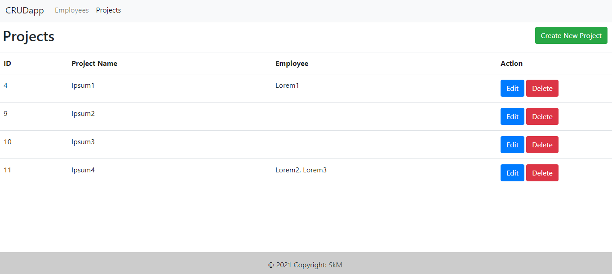

# CRUD app made with Laravel

## Installation

Please check the [official laravel installation](https://laravel.com/docs/8.x/installation) guide for server requirements before you start.

Clone the repository

    git clone git@github.com:skaistulis/sprint5.git

Switch to the repo folder

    cd sprint5

Install all the dependencies using composer

    composer install

Copy the example env file and make the required configuration changes in the .env file

    cp .env.example .env

Generate a new application key

    php artisan key:generate

Run the database migrations (**Set the database connection in .env before migrating**)

    php artisan migrate

Start the local development server

    php artisan serve

You can now access the server at http://localhost:8000/sprint5

**Make sure you set the correct database connection information before running the migrations** [Environment variables](#environment-variables)

    php artisan migrate
    php artisan serve

## Some screenshots of this project

